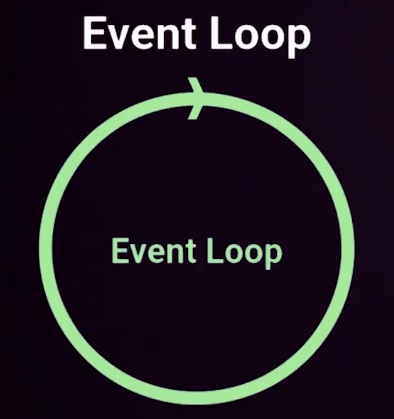

# Curso de Fundamentos de Node.js | Platzi

  

## Index
- [Orígenes y Filosofia](#orígenes-y-filosofia)
  - [¿Qué es node.js?](#qué-es-node)
- [Características de Node.js](#características-de-node)
  - [Concurrencia](#concurrencia)
  - [Motor v8](#motor-v8)
  - [Módulos](#módulos)
  - [Orientado a eventos](#orientado-a-eventos)
- [Event Loop](#event-loop)

## Orígenes y Filosofia

### ¿Qué es node?
Es un entorno de ejecución de javascript fuera del navegador
nos permite ejecutarlo en cualquier lugar que nos permita ejecutar software
Se crea en 2009 y esta orientado a servidores

  <small><a href="#index">↑ Volver al inicio</a></small>

## Características de Node

### Concurrencia
Aunque sea monohilo todas sus entradas y salidas son asincronas
un proceso por cada núcleo del procesador

  <small><a href="#index">↑ Volver al inicio</a></small>

### Motor v8

  

Corre sobre el motor V8 el cual es un entorno de ejecución de javascript
creado por google y liberado en el 2008
convierte nuestro código JS en código maquina en lugar de interpretarlo en tiempo real linea por linea
gracias a esto podemos detectar errores de sintaxis al momento de la compilación y no cuando se llegue a ese parte del código lo cual dota de mucha robustez a nuestro código
esta escrito en c++ por lo que es super veloz

  <small><a href="#index">↑ Volver al inicio</a></small>

### Módulos
Todo en node funciona en base a módulos
todo lo que no sea sintaxis del lenguaje seran modulos
los cuales son piezas de código muy pequeñas
las cuales algunas vienen por defecto y otras tendremos que ir instalandolas
o creas nuestros propios módulos

  <small><a href="#index">↑ Volver al inicio</a></small>

### Orientado a eventos
Node esta orientado a eventos
esto nos quiere decir que hay un bucle de eventos que se ejecutan constantemente
de vez en cuando se dispararan eventos que podemos escuchar
lo cual nos permitira programar de forma reactiva

  <small><a href="#index">↑ Volver al inicio</a></small>

## Event Loop

Nos lo podemos imaginar como un circulo que va dando vueltas y vueltas

  

Es simplemente un bucle que se ejecuta constantemente
Todo lo que se ejecuta en este bucle es de forma asincrona
lo que nos dice que este bucle no se va a bloquear y todo lo que mandemos se ejecutara aparte
por por lo que podemos seguir recibiendo peticiones
por lo que nuestra aplicación sera altamente concurrente

**¿Cómo llegan los eventos a este bucle?**

Provienes desde la cola de eventos (Event Queue)

  

Todo lo que tu ejecutes en tu código, cada linea va a generar eventos
una función, petición, evento, etc
todo lo que tu quieres generar ira a la cola de eventos y se iran mandando uno a uno al event loop
el event loop los procerara, si puede resolverlos lo hara 

Y en caso de que no se pueda resolver rapido lo mandara al thread pool

  

Aqui es done todo se empezara a gestionar de forma asincrona como todo lo que tenga que ver con
operaciones con base de datos, lectura de archivos, operaciones muy lentas
todo eso no estara bloqueando el hilo principal el propio event loop estara funcionando como si nada
y cada hilo se encargara de gestionar sus procesos lentos

Este es el concepto clave para diferenciar node de otros lenguajes de servidor
que por lo general son lenguajes sincronos,
node.js te permite ejecutar en paralelo diferentes tareas y tenerlas de manera mucho más eficientes y eficaz todo esto.

Todo gracias al thread pool

  

Lo que hace es que para cada petición que tenga que hacer levanta un thread, un nuevo hilo dentro de nuestro procesador y automaticamente se va a encargar de que ese proceso se ejecute tardandonse el tiempo que necesite

Mientras que tu event loop se seguira ejecutando y cuando este proceso termine simplemente dispara un evento y el thread pool lo devolvera a nuestro event loop

  

Una vez vuelva al event loop seguira su ejecución y tal vez necesite devolverlo al event queue por que hay un evento que esta escuchando cuando termine este proceso y genere una función nueva pues esa función volverea al event loop y si puede ejecutarla rapidamente lo hara y si no creara un nuevo thread independiente y todo esto estara sucediendo todo el rato en tu código de node

El motor V8 se encargara de que todo esto pase de forma asincrona sin bloquear la entrada o la salida y que tu proceso pueda seguir trabajando y que para ti todo esto sea transparente

Gestionaremos todo esto con las funciones asincronas del lenguaje 

  <small><a href="#index">↑ Volver al inicio</a></small>

